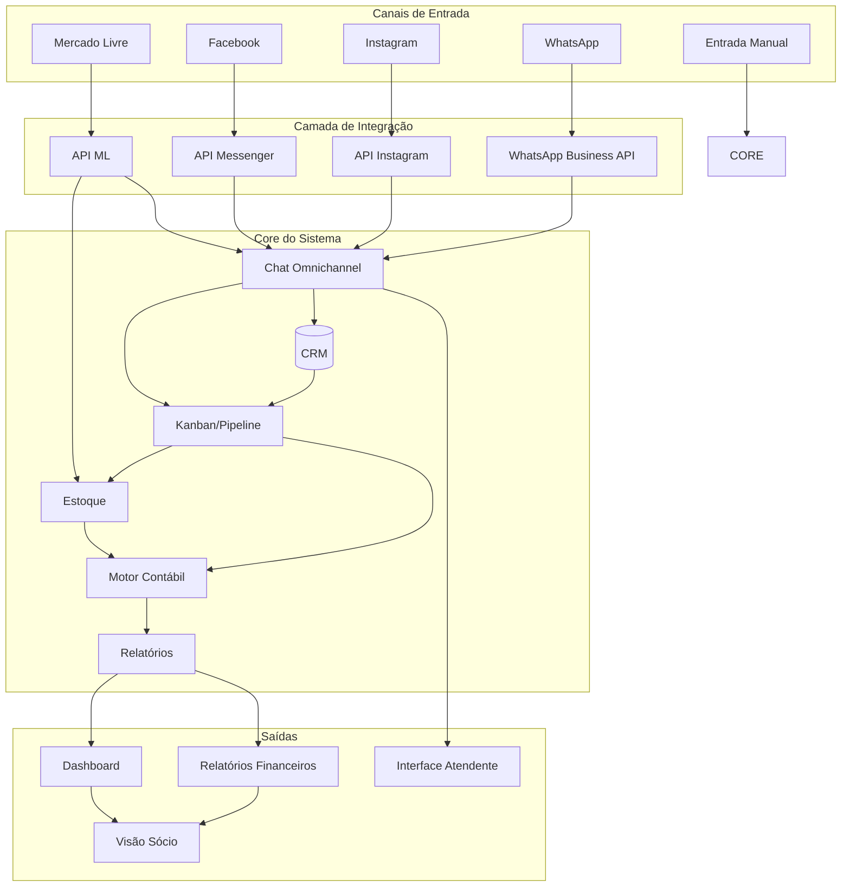
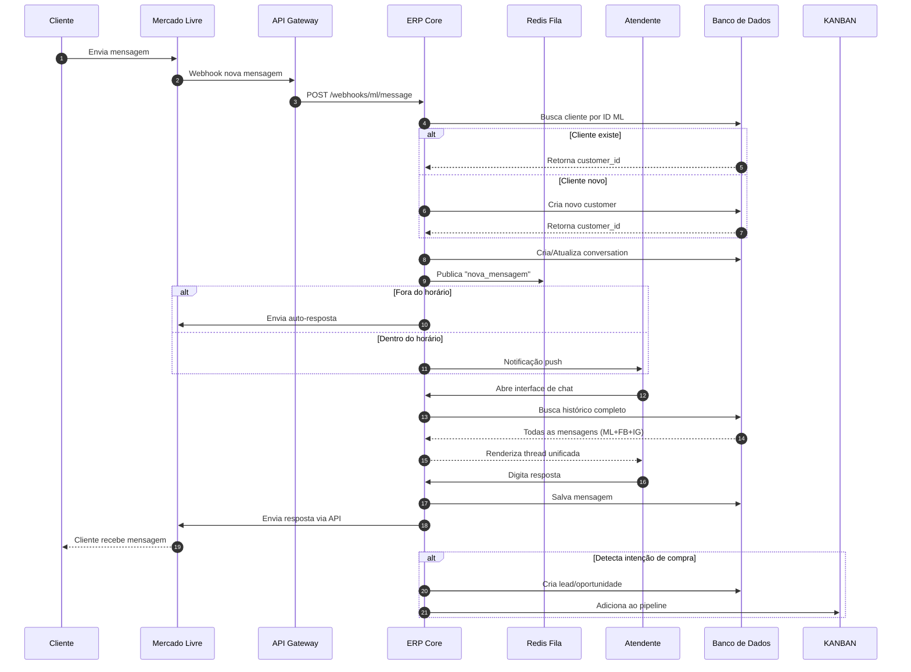
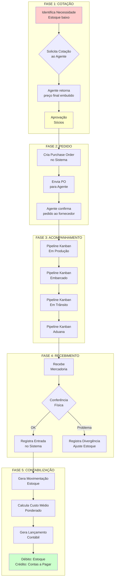
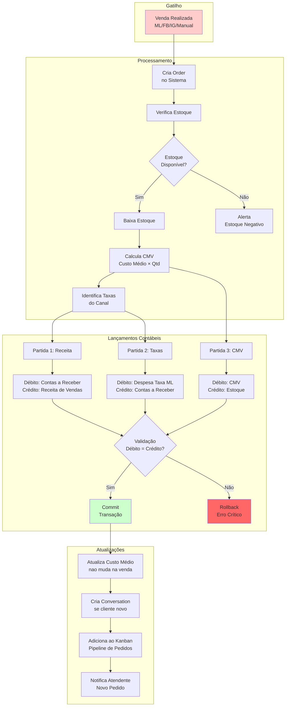
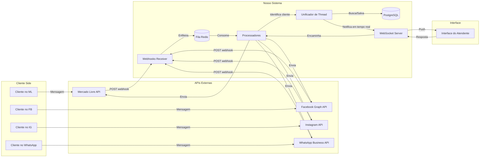
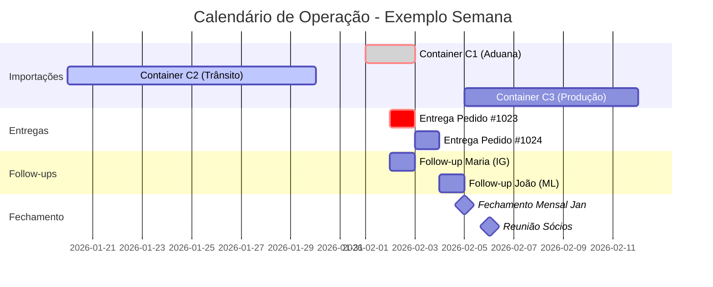
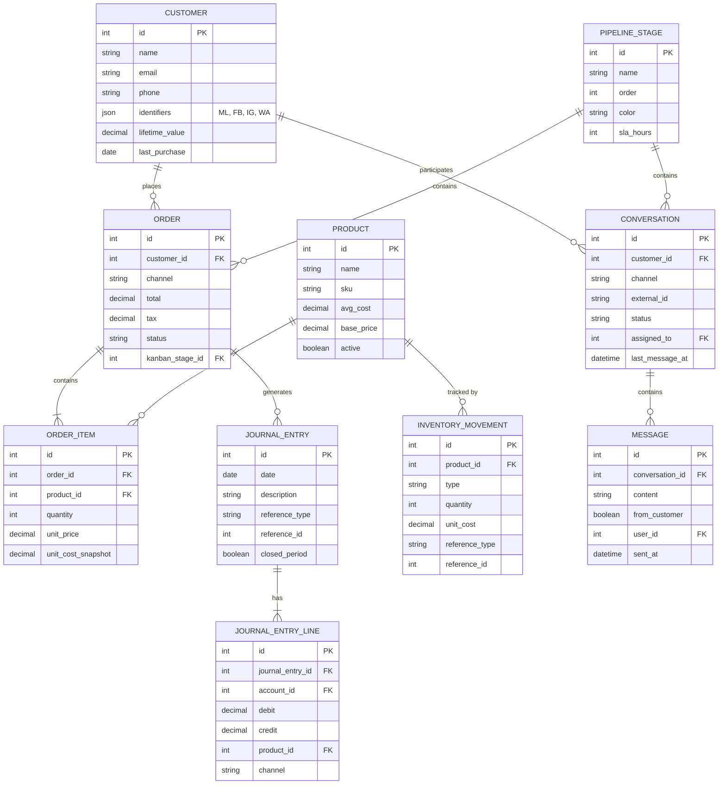
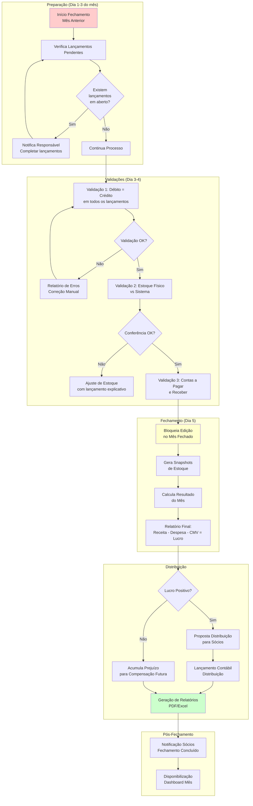

# Diagramas e Fluxos - Sistema ERP/CRM

## Visualização Completa da Operação

---

## 📊 Diagrama Geral do Sistema



**Legenda**: O sistema recebe dados de múltiplos canais, centraliza no core (chat, estoque, contabilidade), e gera visões diferentes para cada perfil de usuário.

---

## 🔄 Fluxo Completo de Atendimento Omnichannel



**Pontos importantes**:

1. Cliente pode estar em múltiplos canais, mas vê unificado
2. Atendente vê histórico de todos os canais numa tela só
3. Mensagens são persistidas antes de enviar (garantia de entrega)
4. Intenções detectadas automaticamente criam oportunidades no kanban

---

## 📦 Fluxo de Importação (Compra com Agente)



**Detalhamento do Cálculo de Custo**:

```
┌─────────────────────────────────────────────────────────┐
│  CÁLCULO DE CUSTO NA IMPORTAÇÃO                        │
├─────────────────────────────────────────────────────────┤
│                                                         │
│  Produto A:                                            │
│  ├── Preço fornecedor (já com comissão agente): $100  │
│  ├── Quantidade: 100 unidades                          │
│  ├── Subtotal: $10.000                                │
│  │                                                     │
│  Rateio de Custos Adicionais:                          │
│  ├── Frete internacional: $2.000 → $20/unidade        │
│  ├── Taxas importação: $1.500 → $15/unidade           │
│  │                                                     │
│  CUSTO FINAL UNITÁRIO: $100 + $20 + $15 = $135        │
│  │                                                     │
│  CUSTO MÉDIO PONDERADO:                                │
│  ├── Estoque atual: 50 unidades @ $120 = $6.000       │
│  ├── Nova entrada: 100 unidades @ $135 = $13.500      │
│  ├── Total: 150 unidades = $19.500                    │
│  ├── NOVO CUSTO MÉDIO: $19.500 / 150 = $130          │
│                                                         │
└─────────────────────────────────────────────────────────┘
```

---

## 💰 Fluxo de Venda com Contabilidade Automática



**Exemplo Detalhado de Lançamentos**:

```
┌─────────────────────────────────────────────────────────────────┐
│  VENDA NO MERCADO LIVRE                                        │
│  Produto X - 2 unidades a R$ 50 cada = R$ 100 total            │
├─────────────────────────────────────────────────────────────────┤
│                                                                 │
│  DADOS DA OPERAÇÃO:                                            │
│  ├── Valor Venda: R$ 100,00                                   │
│  ├── Taxa ML (15%): R$ 15,00                                  │
│  ├── Custo Médio Atual: R$ 27,00/unidade                      │
│  ├── CMV Total: R$ 54,00 (2 × R$ 27)                          │
│  └── Lucro Bruto: R$ 31,00 (100 - 15 - 54)                    │
│                                                                 │
├─────────────────────────────────────────────────────────────────┤
│  LANÇAMENTOS GERADOS AUTOMATICAMENTE:                          │
├─────────────────────────────────────────────────────────────────┤
│                                                                 │
│  1️⃣ RECEITA (Momento da venda)                                │
│  ┌─────────────────────────────────────────────────────────┐   │
│  │  DÉBITO    1.1.03 Contas a Receber ML    R$ 100,00     │   │
│  │  CRÉDITO   4.1.01 Receita Vendas ML      R$ 100,00     │   │
│  └─────────────────────────────────────────────────────────┘   │
│                                                                 │
│  2️⃣ TAXA DO MARKETPLACE                                        │
│  ┌─────────────────────────────────────────────────────────┐   │
│  │  DÉBITO    6.1.01 Despesa Taxa ML         R$ 15,00     │   │
│  │  CRÉDITO   1.1.03 Contas a Receber ML     R$ 15,00     │   │
│  └─────────────────────────────────────────────────────────┘   │
│                                                                 │
│  3️⃣ CUSTO DA MERCADORIA VENDIDA (CMV)                          │
│  ┌─────────────────────────────────────────────────────────┐   │
│  │  DÉBITO    5.1.00 CMV                     R$ 54,00     │   │
│  │  CRÉDITO   1.1.05 Estoque                 R$ 54,00     │   │
│  └─────────────────────────────────────────────────────────┘   │
│                                                                 │
│  VALIDAÇÃO: Débitos (100+15+54) = Créditos (100+15+54) = 169 ✓│
│                                                                 │
│  RESULTADO NA CONTABILIDADE:                                   │
│  ├── Contas a Receber ML: R$ 85,00 (100 - 15)                 │
│  ├── Receita: +R$ 100,00                                      │
│  ├── Despesa: -R$ 15,00                                       │
│  ├── CMV: -R$ 54,00                                           │
│  └── Lucro Bruto: R$ 31,00                                    │
│                                                                 │
└─────────────────────────────────────────────────────────────────┘
```

---

## 🎯 Pipeline Kanban Visual

### 1. Pipeline de Pedidos (Vendas)

```
┌─────────────┐   ┌─────────────┐   ┌─────────────┐   ┌─────────────┐   ┌─────────────┐
│   NOVO      │   │  PAGAMENTO  │   │   EM        │   │   ENVIADO   │   │  ENTREGUE   │
│   PEDIDO    │ → │  CONFIRMADO │ → │  SEPARAÇÃO  │ → │             │ → │             │
├─────────────┤   ├─────────────┤   ├─────────────┤   ├─────────────┤   ├─────────────┤
│ #1023 ML    │   │ #1019 FB    │   │ #1015 ML    │   │ #1010 IG    │   │ #1005 ML    │
│ João - R$150│   │ Maria - R$89│   │ Pedro- R$210│   │ Ana - R$45  │   │ Luca - R$320│
│ 🔴 5min     │   │ 🟡 2h       │   │ 🟢 10min    │   │ 🟢 enviado  │   │ ✅ ontem    │
├─────────────┤   ├─────────────┤   ├─────────────┤   ├─────────────┤   ├─────────────┤
│ #1022 IG    │   │             │   │             │   │ #1009 ML    │   │             │
│ Ana - R$45  │   │             │   │             │   │ João - R$150│   │             │
│ 🟡 1h       │   │             │   │             │   │ 🟢 enviado  │   │             │
└─────────────┘   └─────────────┘   └─────────────┘   └─────────────┘   └─────────────┘

Legenda:
🔴 = Atrasado (passou do SLA)
🟡 = Alerta (próximo do SLA)
🟢 = No prazo
```

### 2. Pipeline de Atendimento

```
┌─────────────┐   ┌─────────────┐   ┌─────────────┐   ┌─────────────┐   ┌─────────────┐
│   NOVO      │   │   EM        │   │  AGUARDANDO │   │   RESOLVIDO │   │   FECHADO   │
│   CHAT      │ → │  ANÁLISE    │ → │   CLIENTE   │ → │             │ → │             │
├─────────────┤   ├─────────────┤   ├─────────────┤   ├─────────────┤   ├─────────────┤
│ ML: João    │   │ IG: Maria   │   │ FB: Pedro   │   │ WA: Ana     │   │ ML: Carlos  │
│ "Tem azul?" │   │ "Problema   │   │ "Aguardo    │   │ "Resolvido!"│   │ Ocorrência  │
│ 🔴 20min    │   │  na entrega"│   │  boleto"    │   │ ✅          │   │ finalizada  │
│             │   │ 🟡 45min    │   │ 🟢 2h       │   │             │   │             │
├─────────────┤   ├─────────────┤   ├─────────────┤   ├─────────────┤   ├─────────────┤
│ FB: Maria   │   │             │   │             │   │             │   │             │
│ "Quanto     │   │             │   │             │   │             │   │             │
│  custa?"    │   │             │   │             │   │             │   │             │
│ 🟡 35min    │   │             │   │             │   │             │   │             │
└─────────────┘   └─────────────┘   └─────────────┘   └─────────────┘   └─────────────┘
```

### 3. Pipeline de Importações

```
┌─────────────┐   ┌─────────────┐   ┌─────────────┐   ┌─────────────┐   ┌─────────────┐
│  COTAÇÃO    │   │   PEDIDO    │   │   EMBARQUE  │   │   TRÂNSITO  │   │  RECEBIDO   │
│  SOLICITADA │ → │   FEITO     │ → │   REALIZADO │ → │             │ → │             │
├─────────────┤   ├─────────────┤   ├─────────────┤   ├─────────────┤   ├─────────────┤
│ Container C3│   │ Container C2│   │ Container C1│   │ Container B2│   │ Container B1│
│ Agente: João│   │ Agente: Ana │   │ Navio: XPTO │   │ Chega: 05/02│   │ Recebido:   │
│ Prod: A,B,C │   │ Prod: D,E   │   │ Data: 15/01 │   │ Prod: F,G   │   │ 20/01       │
│ Total: $5k  │   │ Total: $3k  │   │             │   │             │   │ Prod: A,B   │
└─────────────┘   └─────────────┘   └─────────────┘   └─────────────┘   └─────────────┘
```

---

## 📱 Fluxo de Integração de Chat (Detalhado)



**Fluxo de Identificação do Cliente**:

```
┌─────────────────────────────────────────────────────────────────┐
│  UNIFICAÇÃO DE CLIENTE OMNICHANNEL                             │
├─────────────────────────────────────────────────────────────────┤
│                                                                 │
│  CENÁRIO: Cliente "Maria Silva"                                  │
│                                                                 │
│  Canal 1 - Mercado Livre:                                        │
│  ├── ID ML: 123456789                                           │
│  ├── Nome: Maria Silva                                          │
│  ├── Email: maria@gmail.com                                     │
│  └── Telefone: (11) 98765-4321                                  │
│       ↓                                                         │
│  Sistema: Cliente não existe → Cria customer_id: 1001           │
│  ├── Salva ID ML como identificador                             │
│  └── Associa telefone e email                                   │
│                                                                 │
├─────────────────────────────────────────────────────────────────┤
│                                                                 │
│  3 dias depois... Canal 2 - Instagram:                           │
│  ├── ID IG: maria.silva.88                                      │
│  ├── Nome: Maria Silva                                          │
│  └── (sem email/telefone visível)                               │
│       ↓                                                         │
│  Sistema: ID IG não existe, mas nome é "Maria Silva"            │
│  ├── Sugere: "Este é o mesmo Maria Silva do ML?"                │
│  ├── Atendente confirma                                         │
│  └── Sistema: Adiciona ID IG ao customer_id: 1001               │
│                                                                 │
├─────────────────────────────────────────────────────────────────┤
│                                                                 │
│  Resultado:                                                      │
│  customer_id: 1001                                              │
│  ├── Identificadores: [ML:123456789, IG:maria.silva.88]         │
│  ├── Compras: [Pedido #100 ML, Pedido #105 IG]                  │
│  └── Conversas: [ML:5 msgs, IG:3 msgs]                          │
│                                                                 │
│  Atendente vê:                                                   │
│  "Maria Silva - Cliente desde 15/01/2026                        │
│   Total comprado: R$ 850,00                                     │
│   Última compra: 3 dias atrás (Instagram)                       │
│   Histórico de conversas: 8 mensagens"                          │
│                                                                 │
└─────────────────────────────────────────────────────────────────┘
```

---

## 🗓️ Fluxo do Calendário e Eventos



**Tipos de Eventos Automáticos**:

```
┌─────────────────────────────────────────────────────────────────┐
│  EVENTOS GERADOS AUTOMATICAMENTE                               │
├─────────────────────────────────────────────────────────────────┤
│                                                                 │
│  1. PIPELINE DE IMPORTAÇÃO:                                    │
│     Quando Container muda de "Trânsito" → "Aduana"              │
│     └── Cria evento: "Previsão chegada Container X"            │
│         Data: Hoje + 3 dias                                    │
│         Responsável: Responsável por importações               │
│                                                                 │
│  2. PEDIDO ENTREGUE:                                           │
│     Quando pedido muda para "Entregue"                         │
│     └── Cria evento: "Follow-up cliente Y"                     │
│         Data: Hoje + 7 dias                                    │
│         Descrição: "Ligar para saber se gostou do produto"     │
│                                                                 │
│  3. ESTOQUE BAIXO:                                             │
│     Quando estoque < mínimo definido                           │
│     └── Cria evento: "Repor estoque Produto Z"                 │
│         Prioridade: Alta                                       │
│                                                                 │
│  4. FECHAMENTO MENSAL:                                         │
│     Recorrente todo dia 5                                      │
│     └── Cria evento: "Fechamento Contábil Mês X"               │
│         Duração: 4 horas                                       │
│         Responsável: Sócio responsável                         │
│                                                                 │
│  5. ENTREGA AGENDADA:                                          │
│     Cliente escolhe data no checkout (futuro)                  │
│     └── Cria evento: "Entrega Pedido #XXX no endereço Y"       │
│         Com notificação 1 dia antes e 2 horas antes            │
│                                                                 │
└─────────────────────────────────────────────────────────────────┘
```

---

## 📊 Diagrama de Entidades (ER Simplificado)



---

## 🔐 Fluxo de Fechamento Mensal (Contábil)



**Checklist de Fechamento**:

```
┌─────────────────────────────────────────────────────────────────┐
│  CHECKLIST DE FECHAMENTO MENSAL                                │
│  Mês/Ano: _____/______                                         │
│  Responsável: ___________________                              │
│  Data: __/__/____                                              │
├─────────────────────────────────────────────────────────────────┤
│                                                                 │
│  □ 1. CONFERÊNCIA DE LANÇAMENTOS                               │
│    □ Todos os pedidos do mês estão lançados?                   │
│    □ Todas as compras/importações estão registradas?           │
│    □ Todas as devoluções foram processadas?                    │
│    □ Todas as taxas de marketplace foram importadas?           │
│    □ Não há lançamentos em rascunho                            │
│                                                                 │
│  □ 2. VALIDAÇÃO CONTÁBIL                                       │
│    □ Soma de débitos = Soma de créditos (por dia)              │
│    □ Não há contas com saldo negativo indevido                 │
│    □ CMV foi calculado corretamente                            │
│    □ Receitas estão classificadas por canal                    │
│                                                                 │
│  □ 3. CONFERÊNCIA DE ESTOQUE                                   │
│    □ Contagem física realizada?                                │
│    □ Diferenças ajustadas com lançamento justificado?          │
│    □ Custo médio recalculado e coerente?                       │
│                                                                 │
│  □ 4. CONTAS A PAGAR/RECEBER                                   │
│    □ Saldo de contas a receber confere com extratos?           │
│    □ Contas a pagar de importações estão corretas?             │
│    □ Não há recebimentos pendentes de meses anteriores?        │
│                                                                 │
│  □ 5. FECHAMENTO TÉCNICO                                       │
│    □ Mês marcado como "Fechado" no sistema                     │
│    □ Snapshot de estoque gerado e arquivado                    │
│    □ Edição bloqueada para o mês fechado                       │
│    □ Backup do banco de dados realizado                        │
│                                                                 │
│  □ 6. RESULTADO E DISTRIBUIÇÃO                                 │
│    □ Receita Total: R$ _______________                         │
│    □ CMV Total: R$ _______________                             │
│    □ Despesas Total: R$ _______________                        │
│    □ LUCRO BRUTO: R$ _______________                           │
│    □ Proposta de distribuição aprovada pelos sócios?           │
│    □ Lançamento de distribuição contábil gerado?               │
│                                                                 │
│  □ 7. COMUNICAÇÃO                                              │
│    □ Relatório gerado em PDF                                   │
│    □ Sócios notificados                                        │
│    □ Próximos passos definidos                                 │
│                                                                 │
│  Assinatura Responsável: ___________________                   │
│  Data Conclusão: __/__/____                                    │
│                                                                 │
└─────────────────────────────────────────────────────────────────┘
```

---

## 🎨 Wireframes de Telas Principais

### Dashboard do Sócio

```
┌─────────────────────────────────────────────────────────────────────────────┐
│  XELOSHOP ERP                                    [Sair]  Config  Ajuda     │
├─────────────────────────────────────────────────────────────────────────────┤
│                                                                             │
│  ┌─────────────────────────────────────────────────────────────────────┐   │
│  │  RESUMO DO MÊS - FEVEREIRO/2026                                     │   │
│  ├─────────────────────────────────────────────────────────────────────┤   │
│  │                                                                     │   │
│  │   ┌─────────────┐  ┌─────────────┐  ┌─────────────┐  ┌───────────┐ │   │
│  │   │  RECEITA    │  │    CMV      │  │  DESPESAS   │  │   LUCRO   │ │   │
│  │   │             │  │             │  │             │  │           │ │   │
│  │   │  R$ 45.230  │  │  R$ 18.450  │  │  R$ 12.800  │  │ R$ 13.980 │ │   │
│  │   │    ↑ 12%    │  │    ↑ 8%     │  │    ↑ 5%     │  │   ↑ 23%   │ │   │
│  │   │ vs jan/26   │  │   vs jan/26 │  │   vs jan/26 │  │ vs jan/26 │ │   │
│  │   └─────────────┘  └─────────────┘  └─────────────┘  └───────────┘ │   │
│  │                                                                     │   │
│  └─────────────────────────────────────────────────────────────────────┘   │
│                                                                             │
│  ┌───────────────────────────┐  ┌───────────────────────────────────────┐  │
│  │  LUCRO POR CANAL          │  │  PRODUTOS MAIS LUCRATIVOS            │  │
│  ├───────────────────────────┤  ├───────────────────────────────────────┤  │
│  │                           │  │                                       │  │
│  │  ███████████████████ ML   │  │  1. Produto A........... R$ 5.400    │  │
│  │  ███████████ FB           │  │  2. Produto C........... R$ 4.200    │  │
│  │  ████████ IG              │  │  3. Produto B........... R$ 3.800    │  │
│  │                           │  │                                       │  │
│  │  ML:  R$ 28.000 (63%)     │  │  Ver todos →                          │  │
│  │  FB:  R$ 12.000 (27%)     │  │                                       │  │
│  │  IG:  R$ 5.230  (10%)     │  │                                       │  │
│  │                           │  │                                       │  │
│  └───────────────────────────┘  └───────────────────────────────────────┘  │
│                                                                             │
│  ┌───────────────────────────┐  ┌───────────────────────────────────────┐  │
│  │  ALERTAS E PENDÊNCIAS     │  │  PIPELINE DE IMPORTAÇÕES              │  │
│  ├───────────────────────────┤  ├───────────────────────────────────────┤  │
│  │ ⚠️  Estoque baixo:        │  │                                       │  │
│  │     • Produto X (3 unid)  │  │  🚢 C2: Em Trânsito (chega 05/02)    │  │
│  │     • Produto Y (5 unid)  │  │  📦 C3: Em Produção (agente: Ana)    │  │
│  │                           │  │  ✅ C1: Recebido (20/01)             │  │
│  │ 🔴 3 conversas sem        │  │                                       │  │
│  │    resposta há +30min     │  │                                       │  │
│  │                           │  │                                       │  │
│  │ 💰 Fechamento Jan/26:     │  │                                       │  │
│  │    Disponível para        │  │                                       │  │
│  │    distribuição           │  │                                       │  │
│  │                           │  │                                       │  │
│  └───────────────────────────┘  └───────────────────────────────────────┘  │
│                                                                             │
└─────────────────────────────────────────────────────────────────────────────┘
```

### Interface do Atendente (Chat Unificado)

```
┌─────────────────────────────────────────────────────────────────────────────┐
│  XELOSHOP - Central de Atendimento        [Online]  Maria (Atendente)      │
├──────────────┬──────────────────────────────────────────────────────────────┤
│              │                                                              │
│  CONVERSAS   │  👤 Maria Silva (Cliente desde Jan/2026)                    │
│              │  📱 ML, IG, WA  |  💰 Total: R$ 850  |  🛒 3 compras        │
│  ┌────────┐  │                                                              │
│  │🔍 Buscar│  │  ─────────────────────────────────────────────────────    │
│  └────────┘  │                                                              │
│              │  Maria (WhatsApp) - Ontem, 14:30                           │
│  🔴 Urgente  │  "Oi, meu pedido #1023 ainda não chegou"                   │
│  • João ML   │                                                              │
│  • Ana IG    │  Você (Ontem, 14:35):                                       │
│              │  "Vou verificar para você!"                                 │
│  🟡 Aguardando│                                                             │
│  • Pedro FB  │  Maria (WhatsApp) - Ontem, 18:20                           │
│              │  "Já chegou, obrigada!"                                     │
│  🟢 Ativos   │                                                              │
│  • Maria WA  │  ━━━━━━━━━━━━━━━━━━━━━━━━━━━━━━━━━━━━━━━━━━━━━━━━━━━━━━━━   │
│  • Carlos ML │  OUTRAS CONVERSAS COM ESTE CLIENTE:                         │
│  • Luiza IG  │                                                              │
│              │  📷 Instagram (3 dias atrás):                                │
│  ✓ Fechados  │  "Tem na cor azul?" → "Sim, vou enviar link"               │
│              │  Resultado: Comprou R$ 300                                  │
│  ────────────│                                                              │
│  Canais:     │  🛒 Mercado Livre (1 semana atrás):                         │
│  ☑ ML  ☑ FB │  "Qual tamanho devo comprar?"                               │
│  ☑ IG  ☑ WA │  Resultado: Comprou R$ 550                                  │
│              │                                                              │
├──────────────┤  ─────────────────────────────────────────────────────     │
│ TEMPLATES:   │                                                              │
│ /trocar      │  ┌──────────────────────────────────────────────────┐     │
│ /prazo       │  │ Digite sua mensagem...              [📎] [😊] [📤]│     │
│ /rastreio    │  └──────────────────────────────────────────────────┘     │
│              │                                                              │
└──────────────┴──────────────────────────────────────────────────────────────┘
```

### Tela Kanban (Pipeline)

```
┌─────────────────────────────────────────────────────────────────────────────┐
│  PIPELINE: Pedidos de Venda                    [+ Novo Pedido] [Filtros ▼] │
├───────────────┬───────────────┬───────────────┬───────────────┬─────────────┤
│   NOVO        │   PAGAMENTO   │     EM        │    ENVIADO    │  ENTREGUE   │
│   PEDIDO      │   CONFIRMADO  │   SEPARAÇÃO   │               │             │
├───────────────┼───────────────┼───────────────┼───────────────┼─────────────┤
│               │               │               │               │             │
│ ┌───────────┐ │ ┌───────────┐ │ ┌───────────┐ │ ┌───────────┐ │ ┌─────────┐ │
│ │#1023 ML   │ │ │#1019 FB   │ │ │#1015 ML   │ │ │#1010 IG   │ │ │#1005 ML │ │
│ │           │ │ │           │ │ │           │ │ │           │ │ │         │ │
│ │R$ 150,00  │ │ │R$ 89,00   │ │ │R$ 210,00  │ │ │R$ 45,00   │ │ │R$ 320,00│ │
│ │João Silva │ │ │Maria Souza│ │ │Pedro Costa│ │ │Ana Paula  │ │ │Luca R.  │ │
│ │           │ │ │           │ │ │           │ │ │           │ │ │         │ │
│ │🔴 20min   │ │ │🟡 2h      │ │ │🟢 10min   │ │ │🟢 Ontem   │ │ │✅ Seg   │ │
│ │           │ │ │           │ │ │           │ │ │           │ │ │         │ │
│ │[Ver] [→]  │ │ │[Ver] [→]  │ │ │[Ver] [→]  │ │ │[Ver] [→]  │ │ │[Ver]    │ │
│ └───────────┘ │ └───────────┘ │ └───────────┘ │ └───────────┘ │ └─────────┘ │
│               │               │               │               │             │
│ ┌───────────┐ │               │               │ ┌───────────┐ │             │
│ │#1022 IG   │ │               │               │ │#1009 ML   │ │             │
│ │R$ 45,00   │ │               │               │ │R$ 150,00  │ │             │
│ │Ana Paula  │ │               │               │ │Carlos M.  │ │             │
│ │🟡 45min   │ │               │               │ │🟢 Anteontem││             │
│ │           │ │               │               │ │           │ │             │
│ │[Ver] [→]  │ │               │               │ │[Ver] [→]  │ │             │
│ └───────────┘ │               │               │ └───────────┘ │             │
│               │               │               │               │             │
├───────────────┴───────────────┴───────────────┴───────────────┴─────────────┤
│                                                                             │
│ Legenda: 🔴 Atrasado  🟡 Alerta  🟢 No prazo  ✅ Concluído                  │
│                                                                             │
│ Arraste os cards entre colunas ou clique [→] para avançar                  │
│                                                                             │
└─────────────────────────────────────────────────────────────────────────────┘
```

---

## 🚀 Resumo Visual da Evolução do Sistema

```
┌──────────────────────────────────────────────────────────────────────────────┐
│                         EVOLUÇÃO DO SISTEMA                                  │
├──────────────────────────────────────────────────────────────────────────────┤
│                                                                              │
│  FASE 1              FASE 2               FASE 3              FASE 4+        │
│  (Mês 1)             (Mês 2-3)           (Mês 4-6)           (Mês 6+)        │
│                                                                              │
│     💰                  💰📊                💰📊🏢              💰📊🏢💬        │
│                                                                              │
│  ┌──────┐           ┌────────┐           ┌──────────┐       ┌──────────┐    │
│  │Vendas│           │Integra-│           │Fechamento│       │Atendimento│   │
│  │Manuais│          │ ções   │           │  Mensal  │       │  Chat AI  │   │
│  │      │           │  ML    │           │          │       │           │   │
│  │Lucro │           │        │           │Sócios    │       │Kanban     │   │
│  │Real  │           │Campanhas│          │          │       │Omnichannel│   │
│  │      │           │        │           │Distribui-│       │           │   │
│  │Estoque│          │Relatórios│         │  ção     │       │Automações │   │
│  │      │           │detalhados│         │          │       │           │   │
│  └──────┘           └────────┘           └──────────┘       └──────────┘    │
│                                                                              │
│  PRIORIDADE:        PRIORIDADE:          PRIORIDADE:        PRIORIDADE:     │
│  CRÍTICA ⭐⭐⭐      ALTA ⭐⭐              MÉDIA ⭐              MÉDIA ⭐       │
│                                                                              │
│  "Sem isso         "Sem isso             "Organiza a        "Escala sem     │
│   não sei se       não escala            empresa para       aumentar        │
│   lucro"           automaticamente"      crescimento"       pessoal"        │
│                                                                              │
└──────────────────────────────────────────────────────────────────────────────┘
```

---

**Documento Version**: 1.0
**Última Atualização**: Fevereiro/2026
**Total de Diagramas**: 12 fluxos principais + wireframes
